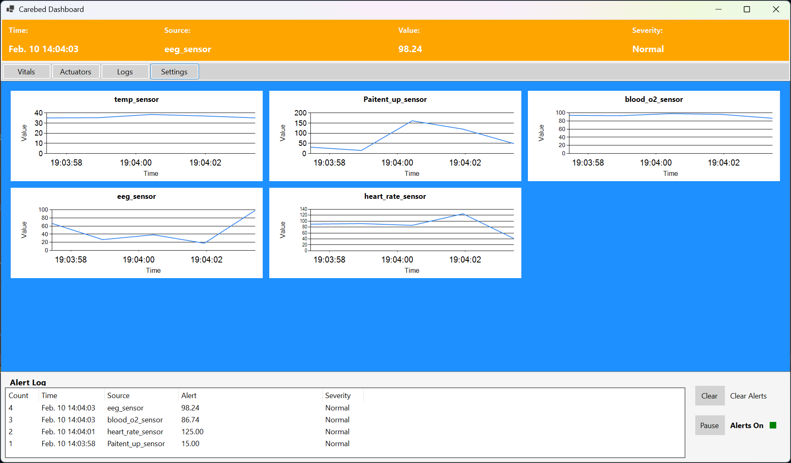

# Carebed System



Carebed is a modular, event-driven system designed for monitoring and managing sensors and actuators in a care environment. The system is built using .NET 8 and Windows Forms, with a focus on extensibility, testability, and clear separation of concerns. 

The main design goal with this system was to utilize an eventBus and very little coupling across modules. Each domain has a manager which listens for messages on the eventBus and delegates orders to the various workers it oversees.

In this way all domains are isolated from each other, except for the messages they receive across the eventBus.

**For a detailed  overview of how all components work together, see [SYSTEM_OVERVIEW.md](SYSTEM_OVERVIEW.md).**

---

## Features
- **Sensor Management:** Polls and aggregates data from multiple sensors.
- **Actuator Management:** Controls actuators such as motors or alarms.
- **Event Bus:** Decoupled event-driven communication between modules.
- **Message Envelopes:** Standardized message wrapping with metadata for routing and logging.
- **Extensible Architecture:** Easily add new sensors, actuators, or managers.
- **Unit Testing:** Includes a test project for core infrastructure and messaging components.

---

## Project Structure
- `Carebed/` - Main application (WinForms UI, managers, infrastructure)
- `Carebed.Tests/` - Unit tests for infrastructure and messaging
- `Class Sheets/` - Documentation for core classes and interfaces

---

## Getting Started

### Prerequisites
- [.NET 8 SDK](https://dotnet.microsoft.com/en-us/download/dotnet/8.0)
- Windows OS (for WinForms support)

### Building the Project
1. Clone the repository:
   ```sh
   git clone https://github.com/Macroger/Carebed.git
   cd Carebed
   ```
2. Build the solution:
   ```sh
   dotnet build
   ```

### Running the Application
1. Navigate to the main project directory:
   ```sh
   cd Carebed
   ```
2. Run the application:
   ```sh
   dotnet run
   ```
   Or launch `Carebed.exe` from the build output directory.

### Running Tests
1. Navigate to the test project directory:
   ```sh
   cd Carebed.Tests
   ```
2. Run the tests:
   ```sh
   dotnet test
   ```

---

## Documentation
- See the `Class Sheets` folder for detailed documentation on core classes and interfaces.

---

## Contributing
Contributions are welcome! Please open issues or submit pull requests for bug fixes, enhancements, or new features.

---

## License
This project is licensed under the GNU General Public License v3.0. See the `LICENSE.txt` file for details.

---

**Copilot AI Acknowledgement:**
Some or all of this documentation was generated or assisted by GitHub Copilot AI.
